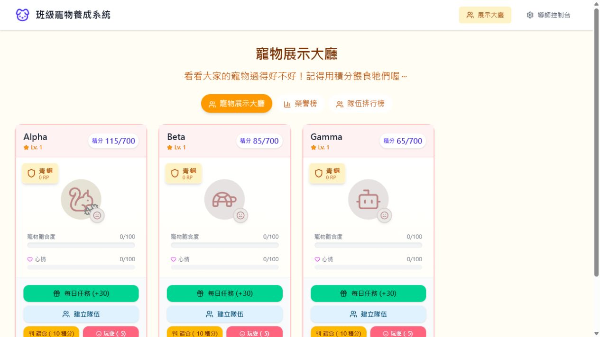
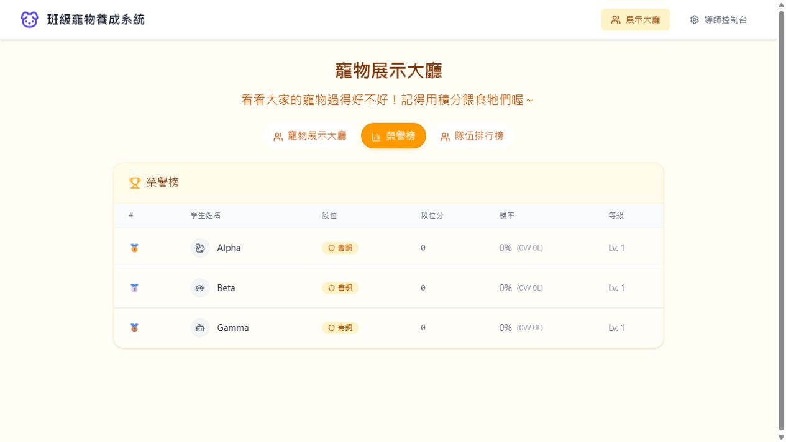
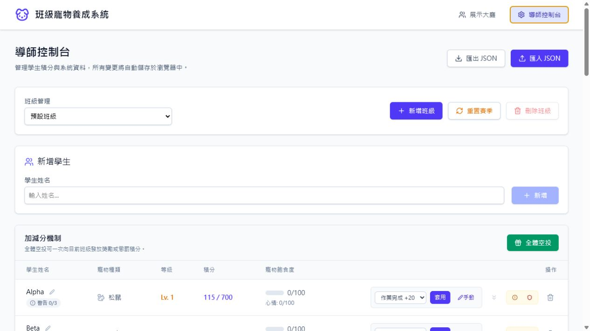
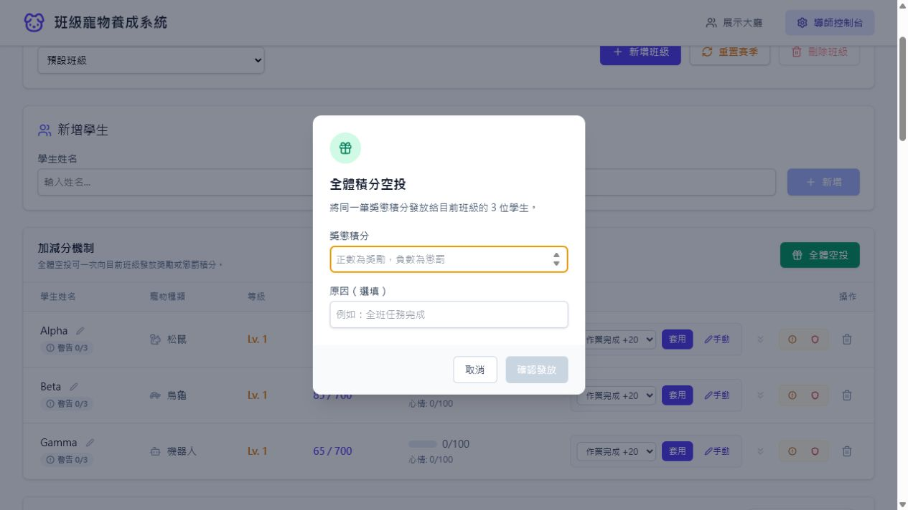
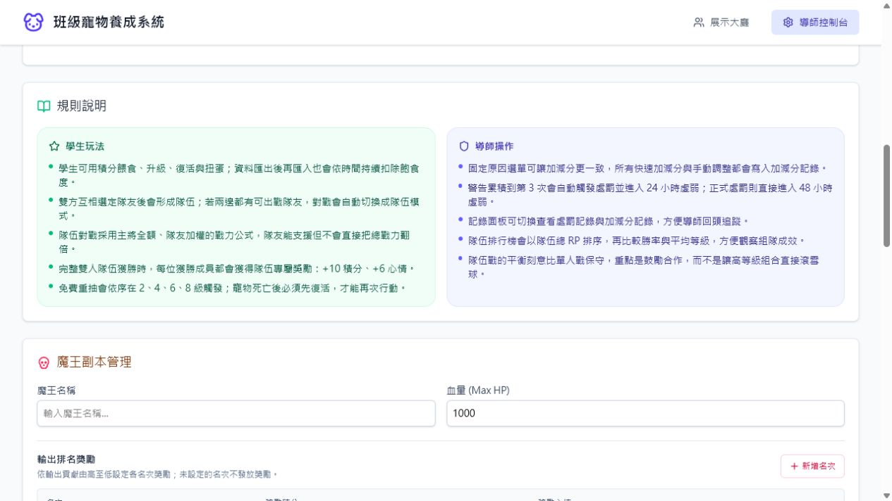
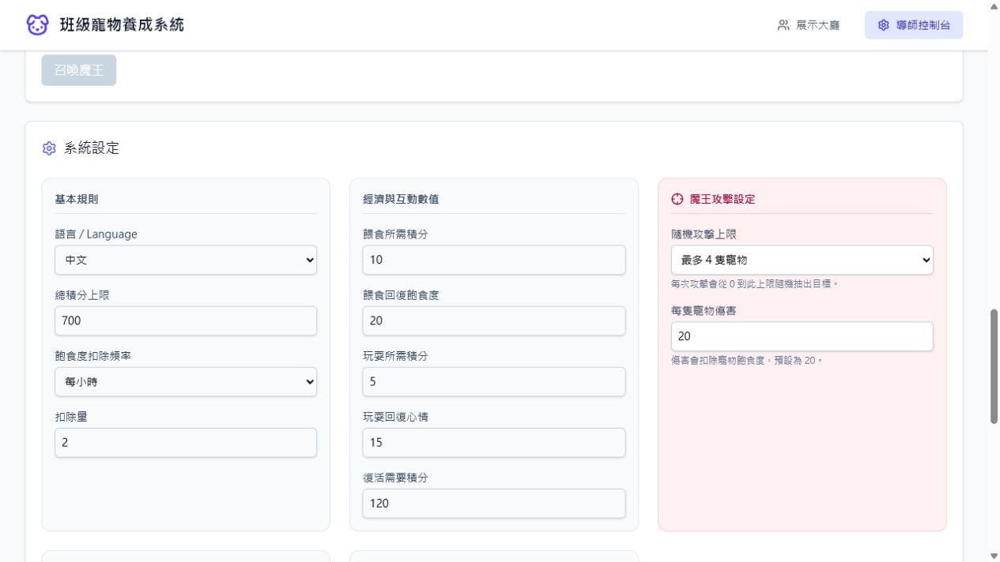

# 班級寵物養成系統：教育輔助性評估

評估日期：2026-07-24

## 結論

本產品具有明確的教育輔助性質，但目前最準確的定位是「班級經營與行為動機工具」，而不是教學內容、形成性評量或學習管理系統。它擅長把課堂參與、作業完成、合作與班級任務轉成即時回饋；目前較缺乏的是學習目標對應、教育成效證據、公平性防護及資料治理。

整體適用於國小高年級到國中、由導師帶領的短週期班級活動。它不適合直接作為成績依據，也不應在沒有隱私與公平性規則時長期公開排名。

## 評分

| 面向 | 評分 | 判斷 |
| --- | ---: | --- |
| 教育輔助辨識度 | 7.5/10 | 行為回饋、導師控制與規則說明完整 |
| 學習目標連結 | 4.5/10 | 有獎勵原因，但未連結課程目標或能力指標 |
| 導師操作效率 | 7/10 | 快速加減分、全體空投與記錄可用，但設定頁過長 |
| 學生動機設計 | 6.5/10 | 寵物、任務與合作具吸引力，仍偏重外在獎勵 |
| 公平與心理安全 | 5/10 | 公開排行、負向狀態與隨機傷害可能造成標籤化 |
| 資料治理與可追溯性 | 4.5/10 | 有匯出與記錄，但資料只存瀏覽器且缺少角色權限 |
| 可及性 | 5.5/10 | 基本標題、表格與按鈕語意存在，仍有低對比與 dialog/tab 語意風險 |

## 流程證據

### 1. 學生展示大廳：中上

優點是積分、飽食度、心情與可執行任務都能立即理解。問題是遊戲數值同時競爭注意力，畫面沒有指出「今天的學習／行為目標」以及積分的取得原因。寵物長期歸零也可能讓落後學生進入更難追趕的負向循環。

### 2. 公開榮譽榜：中，具心理安全風險

排名規則清楚，也能形成短期投入動機；但公開名次、段位與勝率容易把學生固定為高低表現者。當排名與學習證據沒有直接關係時，學生更可能追逐遊戲分數而非真正的學習行為。

### 3. 導師控制台：良好但資訊密度高

固定原因選單、快速套用、警告、正式處罰與記錄是實用的班級管理能力。主要問題是新增學生、分數、處罰、規則、魔王與經濟數值全部串在單一長頁，導師在上課時容易花太多時間搜尋控制項。

### 4. 全體空投：良好

正負數語意、影響人數及原因欄位清楚。改善點是負向全班處分應強制填寫原因、顯示套用後預覽，並提供短時間復原，避免課堂中誤輸入。

### 5. 規則與魔王活動：教育價值混合

規則說明讓導師能理解運作方式，合作隊伍與共同討伐也有班級凝聚價值。輸出排名獎勵及隨機攻擊仍偏向競爭與運氣，可能讓貢獻較低或被隨機命中的學生感到不公平。

### 6. 系統設定：彈性高，決策負擔也高

導師能調整經濟、衰減、傷害及對戰規則，適應不同班級。缺少年齡／班級情境預設、數值影響模擬與安全範圍提示，容易因設定失衡造成寵物快速歸零或獎勵通膨。

## 主要優點

1. 即時、具體且可視化的回饋，比抽象加減分更能吸引學生。
2. 固定獎懲原因與活動記錄提高導師的一致性與可追溯性。
3. 個人、隊伍與全班任務並存，具備從個人責任延伸到合作的潛力。
4. 規則高度可調整，能支援不同年齡與班級文化。
5. 匯入匯出、班級切換與中英文介面提供基本營運能力。

## 主要風險

1. 外在獎勵過強：學生可能只為養寵物與排名行動，沒有形成反思或內在動機。
2. 公開比較過多：段位、勝率、輸出排名可能標籤化學生。
3. 負向循環：低積分、低飽食、低心情、無法對戰與升級會互相強化。
4. 隨機懲罰感：魔王隨機傷害與學生實際行為沒有因果關係。
5. 教學連結不足：沒有課程目標、能力指標、作品或學習證據。
6. 操作風險：快速加減分缺少全域復原；嚴重處罰與負向空投需要更強確認。
7. 資料治理不足：學生姓名與行為記錄只存於瀏覽器，缺少角色權限、保存期限與跨裝置同步。

## 優先改善建議

### P0：教育公平與安全

1. 負分、正式處罰與全班懲罰強制填寫原因，提供 10 秒復原及完整操作紀錄。
2. 排行榜預設改為可選：私人進度、匿名排行、班級合作進度；公開個人排名需由導師啟用。
3. 加入每日獎懲上限、正負回饋比例提醒、最低參與獎勵及落後追趕機制。
4. 衰減可依上課時段、週末與假期暫停，避免學生未使用系統也被持續懲罰。
5. 魔王攻擊預設只造成可恢復的活動狀態，或改為全班共同承擔，不隨機集中在少數學生。

### P1：建立真正的教育連結

1. 將獎勵原因綁定能力面向，例如參與、合作、自我管理、作業品質與成長。
2. 每週設定 1 至 3 個班級目標，學生卡片顯示「下一個可達成目標」及取得積分的原因。
3. 任務完成後加入一句反思或自評，不只發放積分。
4. 提供週報：正負回饋比例、原因分布、未被關注學生、合作參與與趨勢，而非只顯示總分。

### P2：降低導師負擔

1. 將控制台分成學生、獎勵、活動、規則、記錄五個頁籤。
2. 提供「國小低競爭」「合作班級」「短期活動」等安全預設。
3. 設定旁顯示即時模擬，例如一週後平均飽食度與取得一次升級所需天數。
4. 增加批次選取學生、常用原因置頂及最近操作復原。

### P3：可及性與資料治理

1. modal 使用 `dialog`／`aria-modal`、頁籤使用 `tablist`／`aria-selected`，並確認焦點鎖定與鍵盤操作。
2. 提升灰色說明文字與淡色狀態的對比；行動版將寬表格改成學生清單。
3. 提供暱稱／匿名展示、資料保存期限、班級封存、備份提醒與教師角色權限。
4. 對家長與學生清楚說明資料用途，禁止將遊戲分數直接換算正式成績。

## 成效衡量

不要只追蹤登入次數或總積分。建議觀察課堂參與率、正負回饋比例、獎勵分布差距、未被回饋學生比例、合作任務完成率、導師每堂操作時間，以及學生對公平性與壓力的短問卷。

## 證據限制

本次檢查涵蓋學生展示、排行榜、導師分數管理、全體空投、規則／魔王及系統設定。未進行真實師生訪談、長期課堂觀察、螢幕閱讀器完整測試或教育成效實驗，因此不能據此宣稱符合完整 WCAG 或證明能提升學習成效。
