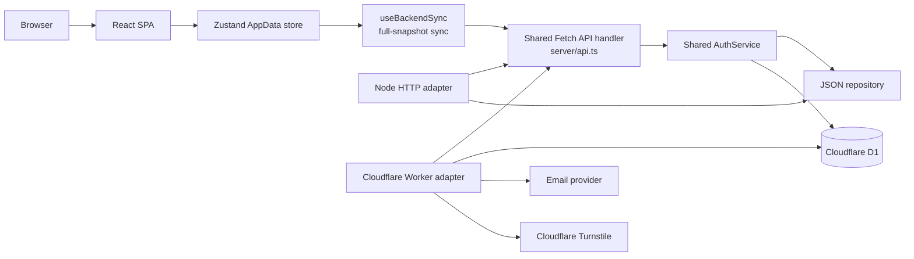
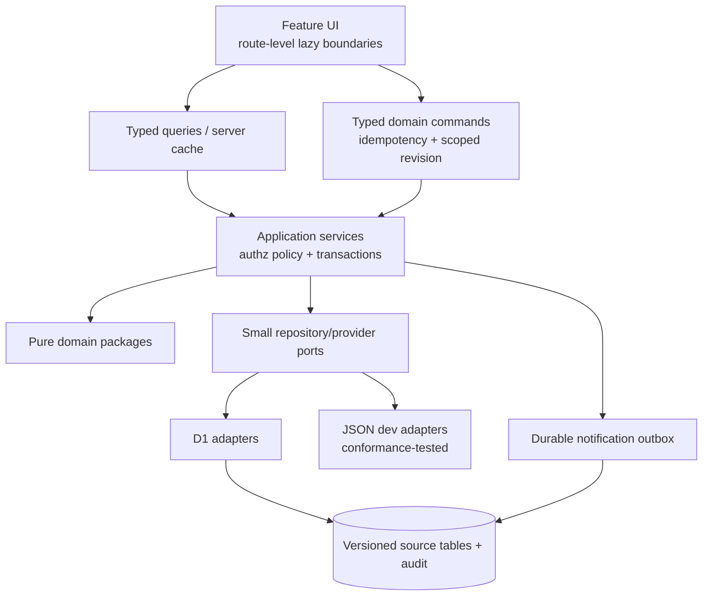

# ePet Architecture Audit

稽核日期：2026-09-02
稽核範圍：目前 `main` 分支（基準 commit：`2f23c00`）的實際原始碼、migration、測試及 GitHub Actions。README 僅作導航，不作為功能完成的證據。

## Executive summary

ePet 已具備可運作的商業產品骨架：React SPA、共用 Fetch API handler、Cloudflare Worker、D1、HttpOnly session cookie、CSRF／Origin 防護、tenant-aware RBAC、revision/CAS 同步、稽核紀錄、資料匯出及可回復 revision。純遊戲規則與教育分析也已有不錯的測試覆蓋。

但目前**尚未達到一般公開商業上架（GA）標準**。上架前至少要修正 4 個 P0：

1. class-scoped 教師在新增學習證據發生 revision conflict 時，錯誤回應可能帶回整個 workspace，造成跨班學生 PII 洩漏。
2. 離線待同步草稿只以 workspace ID 分區，換帳號後可能在同一瀏覽器讀到前一帳號的學生資料。
3. 學生隱私刪除以裸 `studentId` 處理，但 D1 的學生識別實際是 `(classId, studentId)`，碰撞時可能刪不乾淨或刪錯歷史資料。
4. D1 的擁有者移轉缺少資料庫級唯一性與完整 compare-and-swap，併發操作可能產生多位 owner。

完成 P0、建立對應 regression tests，並處理 P1 中的資料容量、ID 唯一性、部署安全與前端同步問題後，才適合逐步開放 production 流量。

## Audit methodology and limitations

- 直接檢查 `src/`、`server/`、`worker/`、`migrations/`、`tests/`、`wrangler.jsonc`、`package.json` 與 `.github/workflows/`。
- 執行現有 lint、全部測試、frontend production build 與 Worker dry-run。
- 以檔案大小、依賴方向、資料流、授權邊界、transaction/CAS、browser storage 及錯誤路徑作靜態追蹤。
- 沒有連線查詢 production D1、Cloudflare secrets、dashboard runtime flags、真實資料量或 observability，因此不能由 repository 證明 production secret 已設定、資料已一致或寄信成功率。
- Codex Security workbench 的 repository 邊界檢查無法接受目前 Windows/OneDrive checkout，因此未產生該工具的掃描結果；本文件採用本機逐檔安全審查。這不影響下列已由原始碼直接確認的問題，但仍建議在標準 Git checkout 補跑自動安全掃描。

### Key source evidence

以下行號以基準 commit 為準；後續修改可能位移：

- Scoped workspace PUT 的 conflict 過濾在 `server/api.ts:1359-1379`；evidence write 在 `server/api.ts:1709-1755`；最外層 full-state conflict serialization 在 `server/api.ts:1783-1788`。
- Pending draft 的 workspace-only storage 在 `src/hooks/useBackendSync.ts:37-87`，persist/restore flow 在同檔約 `270-338`。
- Student purge 的裸 ID 集合在 `server/studentPrivacy.ts:1-55`；D1 composite key 在 `migrations/0003_core_entities.sql:30-49`。
- D1 ownership transfer 在 `worker/repository.ts:1401-1440`；Node 對應實作在 `server/repository.ts:626-647`。
- D1 900 KiB 限制在 `worker/repository.ts:64,372-378`；full normalized reconstruction/checksum 在同檔約 `393-448`。
- Class authorization merge policy 在 `server/workspaceScope.ts:20-94`；production flags 在 `wrangler.jsonc:20-26`；部署順序在 `.github/workflows/deploy.yml`。

## Current architecture



### Runtime topology

- Production：Cloudflare Worker 先處理 `/api/*`，其他路徑由 Workers Assets 提供 Vite SPA；D1 同時保存身份、RBAC、audit、workspace JSON source 與 normalized projections。
- Local development：Vite 將 `/api` proxy 到 Node server；Node adapter 把 Node request 轉成 Web `Request`，重用相同 API handler，資料存進 JSON repository。
- API 與 authentication 的主要實作是共用的，Node/Worker 並非各自維護一套 route；差異集中在 persistence、mailer、bot verification、static assets 與 scheduled job。
- Client 將整份 `AppData` 放在單一 Zustand store，修改後由 `useBackendSync` 以 workspace revision 做 optimistic concurrency control，再 PUT 整份 snapshot。

### Main request and synchronization flow

1. 登入成功後，server 以 `__Host-epet_session` HttpOnly cookie 建立 session，另發可讀的 CSRF cookie。
2. Client 取得 workspace、revision 與授權後可見的資料範圍。
3. UI action 先更新本地 Zustand state。
4. `useBackendSync` debounce 約 600 ms，保存 pending draft 至 `sessionStorage`，再以 `baseRevision` PUT 全量 `AppData`。
5. Repository 使用 compare-and-swap 更新 revision。D1 在同一 batch 寫入 source blob、revision snapshot 及 normalized projections。
6. 衝突時 client 停止自動覆寫並要求重新載入；不提供 field/domain merge。

## 1. Frontend architecture

### Strengths

- React 19 + TypeScript + Vite 的基礎簡潔；`DashboardView`、`ClassroomView` 等主要頁面已有 lazy loading。
- 遊戲規則位於 `src/gameRules.ts`，教育分析位於 `shared/education.ts` 等純函式模組，沒有依賴 React、DOM 或 repository，適合重用與測試。
- 匯入、報表、analytics 已開始抽成獨立模組，不必全部留在 component。
- Authentication session 由獨立 provider 管理；server 仍是授權的最終判定者，UI 隱藏不是唯一防線。

### Technical debt

- `DashboardView.tsx` 仍是 God component：2,665 行、約 133 KB、60 個 `useState`、7 個 `useEffect`、13 個 `useMemo`。它同時負責 navigation、dialogs、任務、帳號、報表、workspace 管理、唯讀包裝及多個 domain 的組裝。
- 多個 dashboard panel 只是以 CSS 隱藏而不是條件卸載；隱藏 panel 仍會 mount、訂閱 store 並計算排序／扁平化資料。
- read-only 模式使用 `Proxy` 和 mutation action 名單包裝 store。這是脆弱的 deny-list：新增 action 時若忘記更新名單，UI 邊界會漂移。Server authorization 可阻止持久化，但 client 仍可能先顯示錯誤狀態。
- UI 與完整 `AppData` shape 高度耦合；components 直接操作深層 class/student/history 結構，增加 schema 演進成本。
- production TS/TSX 約有 77 處 `any`。部分位於輸入正規化邊界可以接受，但 selector、component props 與資料轉換中的 `any` 會削弱 breaking-change 保護。

### Recommended direction

- 以 route/feature boundary 拆分 dashboard，僅 mount 目前可見的 feature。
- 將 component 中的資料轉換與 command 移至 typed domain/application services；component 只做 rendering 與 user intent dispatch。
- 以 capability object 或明確 command interface 取代 Proxy deny-list。
- 為 public DTO、domain model、persisted schema 分別定義 type，避免 `AppData` 同時成為 UI state、API contract 與 database document。

## 2. Backend architecture

### Strengths

- `server/api.ts` 是基於 Web Fetch API 的共用 handler，Node 與 Worker 重用相同 route 與 auth 邏輯，大幅降低 route-level duplication。
- `AuthService` 集中處理 session、password reset、verification、invitation 與 RBAC。
- `workspaceScope.ts` 對 teacher/viewer 做 class scope，teacher 的整份 workspace PUT 還會驗證 class set/settings 不變並只合併已授權班級。
- request body 有大小限制，auth payload 使用更小的限制；錯誤回應大多採結構化格式。

### Technical debt and coupling

- `server/api.ts` 1,876 行，以大型 `if` chain 同時承擔 routing、validation、authorization、serialization、analytics、privacy export 與 workflow orchestration。
- `server/auth.ts` 1,434 行；身份驗證、帳號生命週期、邀請、rate limit 與通知協調集中在同一 service。
- `WorkspaceRepository`/`AuthRepository` contract 過大，任何 adapter 都必須理解幾乎所有 domain。
- Server 直接 import `src/store/types`、`src/store/utils` 及 `src/gameRules`。依賴方向從 backend 指向 frontend 目錄，表示 persisted contract、domain model 與 client state 尚未分層。
- Node server import Worker mail/Turnstile 實作，產生反向依賴。Provider port 應位於 shared application layer，Node/Worker adapters 各自注入。
- Node JSON repository 與 D1 repository 各自實作大型 interface，存在行為差異：容量限制、transaction semantics、owner transfer concurrency 與 projection reconciliation 都不一致。

## 3. Cloudflare Worker architecture

### Strengths

- Worker adapter 薄，主要責任是 environment binding、assets、CSP/security headers、Turnstile、mailer 與 cron，核心 API handler可共用。
- 已設定 `nosniff`、referrer policy、permissions policy、COOP/CORP、HSTS、frame restriction 及 production CSP。
- Scheduled job 會清理過期 auth 資料並 reconcile/repair projection。
- D1 write 使用 batch + write token + source revision，能降低部分更新造成 source/projection 分裂的風險。

### Risks

- `worker/repository.ts` 2,478 行，同時負責身份、RBAC、audit、workspace blob、normalized projection、reconciliation、revision 與 privacy operations。
- 每次 verified normalized read 仍載入多組 result sets、重建整份 workspace，並計算 canonical JSON checksum；成本隨整個 tenant 資料量成長。
- 每次小修改都重寫完整 snapshot 與大量 projection rows；D1 operation 數、CPU、延遲及 contention 都會快速增加。
- Email 使用 `waitUntil` 背景 promise，沒有 durable outbox、重試次數、delivery state 或 dead-letter flow。API 接受邀請／通知工作不代表信件最終已送達。
- `BOT_PROTECTION_REQUIRED=false` 是 fail-open 設定。即使 runtime 可能已配置 secret，repository 本身無法證明 production 強制 bot challenge。
- Worker 與 Node static response headers 有各自版本，可能隨時間漂移。

## 4. D1 database structure

目前 migrations 建立約 22 個 active tables，可分為：

| Domain | Tables / responsibility |
| --- | --- |
| Workspace source | `workspaces`, `workspace_revisions`；保存目前 JSON、revision 與最近 25 份 snapshot |
| Identity | users、sessions、password reset、email verification、rate-limit tables |
| RBAC | memberships、workspace claims、class assignments、invitations |
| Audit | append-oriented audit events |
| Projection control | projection state/documents、source revision、checksum |
| Education projection | classes、students、exams/results、learning evidence、point adjustments、discipline、boss rewards |

### Strengths

- 多數 tenant data 以 `workspace_id` 分區；student key 在 D1 是 `(workspace_id, class_id, student_id)`。
- workspace revision 與 projection source revision 明確；trigger 只保留最近 25 個 revisions。
- migration 為版本化 SQL，CI deployment 會先 apply migration。
- verified projection 失配時會 fallback source blob，cron 可 repair，避免直接把 projection drift 當成正確資料。

### Technical debt and scale risks

- 同一份資料被保存多次：目前完整 JSON、最多 25 個完整 snapshot、normalized scalar columns、`record_json`，而 class/student JSON 又包含部分 nested history。這造成高 write amplification 與 storage amplification。
- `MAX_D1_STATE_BYTES` 為 900 KiB，但 client API body 允許 2 MiB。資料超過 D1 上限時 client 將 413 視為 backend/offline failure，可能反覆重試而沒有可恢復指引。
- AppData 沒有明確 `schemaVersion`；`normalizeAppData` 實際承擔隱式 migration。預設值或 normalization 行為改動會在下一次儲存時改寫資料。
- `normalizeAppData` 未拒絕 workspace 內重複 class IDs 或同班重複 student IDs。Projection 使用 primary key/replace semantics，可能遺失其中一筆、長期 checksum mismatch 並 fallback blob。
- Audit events 沒有明確 retention。Invitation audit metadata 可能保存 normalized email；帳號刪除即使清空 actor，也不一定移除 metadata 內的識別資訊。
- Owner 唯一性只靠 application invariant，沒有 database constraint。

## 5. Authentication / authorization

### Strengths

- Session 使用 Secure、HttpOnly、SameSite=Lax 的 `__Host-epet_session` cookie。
- Mutating request 同時檢查 Origin 與 double-submit CSRF token，token 比對採 constant-time 方法。
- Session、reset、verification、invitation raw tokens 不直接落庫，保存 hash。
- Password 使用 PBKDF2；unknown-user login 仍執行 dummy KDF，forgot-password 使用 generic response 與最低回應時間。
- persistent rate limit 同時涵蓋 IP 與 subject。
- 角色為 owner/admin/teacher/viewer；class assignments 在 server enforcement，teacher/viewer 沒有 assignment 時 fail closed。
- Revision、audit、member administration、privacy export 等敏感 route 限 owner/admin。

### Authorization boundary issues

#### P0 — revision conflict leaks unscoped workspace

Evidence：`server/api.ts` 的一般 teacher workspace PUT 對 `WorkspaceConflictError` 有 class-scoped response；但新增 learning evidence route 做 read-modify-write 後未做同等處理，最外層 catch 直接回傳 `error.current`。

Impact：兩個併發 evidence writes 發生 CAS conflict 時，class-scoped teacher 的失敗回應可能包含未授權班級及學生 PII。

Required fix：repository conflict error 不應攜帶可直接序列化的 full workspace，或由中央 error mapper 依 authenticated scope 過濾；新增 Node 與 D1 併發 regression test。

#### P1 — malformed duplicate IDs can expand scope

Class assignment 以 class ID 判定範圍。如果 workspace 內存在重複 class IDs，單一 assignment 可能同時匹配多個 class objects。Import/normalization 應在 admin write 前拒絕重複 ID，不能等 projection silently replace。

### Additional risks

- Login rate-limit 在驗證前消耗 attempts，成功登入不 reset；短時間多次合法登入也可能觸發「嘗試次數過多」。
- PBKDF2 100k iterations 是目前 Worker runtime 限制下的折衷；商業化 roadmap 應包含可版本化 password hash、逐次 rehash，以及 MFA/SSO 或外部 IdP 選項。
- CORS helper 支援 `allowedOrigins=['*']` 時以 credentials 反射任意 Origin；目前 adapters 傳空清單所以未暴露，但這是危險設定陷阱，應移除 wildcard-with-credentials 能力。

## 6. Data synchronization

### Strengths

- Revision/CAS 防止靜默 last-write-wins。
- Client request ID、pending queue 與 lost-response recovery 能辨識「server 已 commit 但 response 遺失」的情況。
- D1 batch 將 source/projection 同步寫入；projection checksum 與 repair 提供 drift detection。

### Race conditions and synchronization problems

| Priority | Scenario | Consequence | Recommendation |
| --- | --- | --- | --- |
| P0 | learning evidence 的 scoped user 遇到 revision conflict | conflict payload 洩漏完整 workspace | 中央化 scoped conflict serialization；併發測試 |
| P0 | 兩個 owner 同時執行 A→B、A→C ownership transfer | D1 可同時把 B、C 設為 owner | DB invariant + conditional transaction/write token；併發測試 |
| P0 | 同 workspace 換帳號時恢復 `sessionStorage` pending draft | B 帳號看到 A 帳號未同步的學生 PII | key 加 user ID、logout 清除、TTL、remote scope 驗證 |
| P1 | 不同使用者修改不相關班級 | full-snapshot revision 仍衝突 | per-domain/per-class commands 或 revision |
| P1 | workspace 超過 900 KiB | client 視為 offline 並無限重試 | 明確 terminal `data_too_large` state、export/cleanup flow |
| P1 | 多 browser tabs 同時修改 | 沒有 tab coordination/server push | BroadcastChannel + leader/refresh protocol，或 server event invalidation |
| P2 | 6 秒 timeout 遇到大型 projection rewrite | uncertain commit 與反覆 snapshot compare | incremental commands、idempotency keys、可觀測 latency |

### P0 ownership-transfer detail

JSON repository 透過 in-process mutation queue 並在 mutation 內重查 owner，單一 Node process 下較安全。D1 repository 則先讀 source/target，batch 中 conditional demotion 與 unconditional target promotion 分離，且 schema 沒有「每 workspace 僅一位 owner」constraint。這是 Node/Worker behavioral parity 的明確破口。

## 7. State management

### Current state

- 單一 Zustand store 同時保存 persisted `AppData`、選取視圖、toast、animations、modals、undo 及大量 domain actions。
- Auth/session/config 另由 React context 保存。
- `backendApi` 以 module globals 保存 CSRF token、active workspace ID 與 backend availability。

### Risks

- Persisted domain state、server cache 與 ephemeral UI state 沒有邊界，任何 store action 都可能觸發大範圍 selector 更新與全量同步。
- 以深層物件 mutation/clone 表達小型 command，使 conflict resolution 無法辨識獨立 domain。
- Module-global network state不可訂閱，也不隨 React lifecycle 清楚重設，測試及多-session 行為較難推理。
- Pending draft 保存整份學生資料在 `sessionStorage`，擴大 XSS 與 shared-device exposure；即使 CSP 降低風險，仍應資料最小化。

### P0 pending-draft detail

`useBackendSync.ts` 的 draft key 只有 workspace ID，登入重設只處理 Zustand optional localStorage，沒有按 user/session 清理 pending draft。新登入者若同屬 workspace 但僅能看不同班級，可能在 remote scope 驗證前 hydrate 前一人的完整 pending data。Server 不一定接受後續寫入，但 client-side PII exposure 已發生。

## 8. Testing

### Current strengths

- 目前 `npm test` 共 132 tests，全數通過：84 game rules、13 import、8 auth、12 server、15 D1。
- D1 tests 涵蓋 migrations、normalized read/fallback/repair、revision retention、same-revision concurrency、rollback、tenant isolation、write-token atomicity 與 900 KiB guard。
- 純規則測試量充足，對遊戲化行為變更提供良好保護。

### Gaps

- 沒有 React component、hook、`useBackendSync` 或 browser end-to-end tests。
- 沒有 automated accessibility、keyboard、visual regression、responsive 或 cross-browser tests。
- 沒有 coverage threshold；大量 server/Worker branches 是否被測到無法量化。
- Node/D1 adapters 沒有共用 conformance suite，因此同一 repository contract 可有不同 semantics。
- 缺少 4 個 P0 的 regression tests：scoped conflict、cross-account draft、duplicate student privacy purge、concurrent ownership transfer。
- 測試檔本身也偏大，與 production monolith 一起提高修改成本。
- 無負載、large-workspace、cold-start、D1 quota 或 email-delivery failure tests。

## 9. CI/CD

### Strengths

- `main` push deployment 會執行 `npm ci`、完整 `npm run verify`、Wrangler identity check、remote D1 migrations，再 deploy Worker。
- Workflow 有 concurrency control，避免多個 production deploy 無序並行。
- Cloudflare credentials 透過 GitHub secrets 注入，repository 未發現 tracked secret。

### Risks

- 沒有獨立 pull-request CI；問題可能直到 merge `main` 才由 production deployment job 發現。
- Migration 在新 Worker 前套用。所有 schema change 必須同時向前、向後相容，否則 migration 完成但 Worker deploy 失敗時，舊 Worker 可能面對不相容 schema。
- 沒有 pre-migration backup/check、preview/staging、manual production approval、canary、automatic rollback 或 post-deploy smoke test。
- 沒有 dependency review、CodeQL/SAST、secret scanning policy、SBOM 或 scheduled security scan workflow。
- GitHub Actions 使用版本 tag 而非 immutable commit SHA，供應鏈可再強化。
- `deploy:worker` 不會自動 build/verify；`check:worker` 本身也不先 build。人工執行可能部署陳舊 `dist`。
- `npm run clean` 使用 `rm -rf dist`，Windows 本機不具可攜性。
- 本機 OneDrive checkout 的 `dist` 曾保留舊 hashed assets；dry-run 會把未被 `index.html` 引用的舊 chunks 一併視為 assets。乾淨 CI runner 通常不受影響，但 manual deploy 有 storage/cache hygiene 風險。

## 10. Security

### Confirmed risks

| Priority | Risk | Security property | Evidence-based remediation |
| --- | --- | --- | --- |
| P0 | Scoped evidence conflict 回傳 full workspace | Authorization / confidentiality | conflict payload default-deny，依 caller scope serialize；Node+D1 併發測試 |
| P0 | Pending draft 跨帳號恢復 | PII confidentiality | user/session-scoped key、logout purge、TTL、scope validation、最小化 draft |
| P0 | Privacy purge 使用裸 student ID | Erasure correctness / integrity | 全流程改用 `(classId, studentId)`；碰撞 fixture 測試 revisions 與 projections |
| P0 | Concurrent owner transfer 可產生多 owner | Authorization integrity | DB-level unique invariant 或 owner pointer，完整 CAS transaction |
| P1 | Duplicate domain IDs 未拒絕 | Tenant/class isolation | write/import validation，拒絕並回報 collision |
| P1 | Bot protection production default fail-open | Abuse resistance | production config fail-closed，startup/deploy validation |
| P1 | Audit email metadata 無 retention | Privacy/compliance | metadata allowlist/redaction、retention/purge policy |
| P1 | Durable email delivery 不存在 | Account lifecycle reliability | D1 outbox、retry/backoff、delivery state、dead-letter alert |
| P2 | Credentialed CORS wildcard footgun | CSRF/cross-origin isolation | schema/config 層禁止 wildcard，明確 allowlist |
| P2 | Full PII draft 存 browser sessionStorage | XSS impact | 最小 command log、加密不能取代資料最小化、短 TTL |

### P0 privacy-purge detail

D1 schema 允許不同 class 使用相同 `student_id`，但 `studentPrivacy.ts` 收集及追蹤的是裸 `studentId`。刪除其中一位學生時，historical revision purge 可能因另一班同 ID 仍存在而保留被刪學生，或在未來錯誤移除另一班歷史。必須將 composite identity 延伸至 current data、revision snapshots、projection rows、audit metadata 與 export。

### Existing security controls worth preserving

- HttpOnly/Secure/`__Host` session cookie、CSRF + Origin、same-origin defaults。
- Server-enforced role/class scope、zero-assignment fail closed。
- Token-at-rest hashing、password timing defenses、request size limits。
- Security headers/CSP、sensitive audit metadata filtering。
- D1 tenant keys、revision CAS、projection verification與 fallback。

任何 refactor 都不可把這些控制移回 client、放寬 wildcard、或用 generic repository convenience method 繞過 scope。

## 11. Accessibility

### Strengths

- document language 會更新；global CSS 有可見 focus 樣式及 `prefers-reduced-motion` 支援。
- 多處狀態訊息使用 live region/alert，form controls 普遍具 label 或 aria label。
- Auth flow 有基本 focus management。

### Gaps

- Dashboard 的新增班級、刪除、點數等 overlays 缺少一致的 `role="dialog"`、`aria-modal`、accessible name、initial focus、focus trap、Escape close 與 focus return。
- Upgrade reward 與 Classroom overlays 也沒有完整 modal keyboard contract。
- Data Governance/刪除帳號流程雖有部分 Escape/focus 處理，仍缺少通用 dialog primitive 與 background inert。
- 沒有 skip link，長 dashboard 對 keyboard/screen-reader 使用者成本高。
- 沒有 axe、keyboard navigation 或 screen-reader regression test。
- 靜態檢查不能證明所有文字/狀態/圖表色彩達 WCAG 2.2 AA；需用 automated scan 加人工 keyboard、NVDA/VoiceOver、zoom 200% 驗收。

## 12. Performance

### Build baseline

目前 production build 成功，主要輸出約為：

| Asset | Raw | Gzip |
| --- | ---: | ---: |
| Main JS | 415.95 kB | 128.65 kB |
| `DashboardView` chunk | 169.93 kB | 39.78 kB |
| `StudentAnalyticsPanel` | 69.86 kB | 20.62 kB |
| `ClassroomView` | 58.05 kB | 14.68 kB |
| `DataGovernancePanel` | 37.92 kB | 11.32 kB |
| Main CSS | 102.92 kB | 16.75 kB |
| Worker | 298.96 KiB | 56.01 KiB |

### Bottlenecks

- Dashboard hidden features remain mounted and subscribed。
- Full workspace `JSON.stringify` comparison、sessionStorage write、canonical checksum 與 normalized reconstruction 都是 O(workspace size)。
- 每一個小變更觸發 full snapshot PUT、revision copy 與大量 projection rebuild。
- 大型 student/class tables 缺少一致的 pagination/virtualization；資料量上升會同時影響 render、sync、D1 CPU 與 storage。
- Client request timeout 固定 6 秒，資料量成長後更容易進入 uncertain-commit recovery。
- 無 performance budget、bundle regression gate、Web Vitals、D1 query latency 或 workspace-size telemetry。

## Oversized files and components

下表為本次 checkout 的 physical line count；不是只看 bundle size。

| File | Lines | Approx. bytes | Main responsibilities | Priority |
| --- | ---: | ---: | --- | --- |
| `src/store/useStore.ts` | 2,684 | 111,795 | persisted state、UI state、domain commands、undo、notifications | P1 |
| `src/components/DashboardView.tsx` | 2,665 | 132,721 | navigation、60 local states、dialogs、features orchestration | P1 |
| `worker/repository.ts` | 2,478 | 74,480 | auth、RBAC、workspace、projection、audit、revision | P1 |
| `src/gameRules.ts` | 2,102 | 69,141 | multiple game domains/rules | P2 |
| `server/api.ts` | 1,876 | 60,947 | routing、authz、validation、workflow、analytics/export | P1 |
| `server/auth.ts` | 1,434 | 41,319 | login、session、verification、reset、invites、rate-limit | P1 |
| `src/components/ExamAssessmentPanel.tsx` | 1,399 | 59,701 | assessment UI + transformations | P2 |
| `src/store/utils.ts` | 1,201 | 51,211 | normalization、migration defaults、helpers | P1 |
| `server/repository.ts` | 1,185 | 41,063 | JSON persistence for all server domains | P1 |
| `src/components/DataGovernancePanel.tsx` | 1,047 | 52,724 | governance、export、delete、audit/revision UI | P2 |
| `src/components/ClassroomView.tsx` | 1,038 | 56,527 | classroom UI、dialogs、task interactions | P2 |

拆檔本身不是終點；應依 domain ownership、command/query contract 與測試邊界拆分，避免只把同一高度耦合邏輯搬到更多檔案。

## Duplicate logic and implementation drift

### Node server vs Worker

| Area | Shared today | Duplicated / drifting |
| --- | --- | --- |
| API routing/auth | `server/api.ts`, `AuthService` | adapter initialization/config |
| Persistence contract | repository interfaces | JSON vs D1 implementation semantics |
| Ownership transfer | same API intent | Node serialized/rechecked；D1 pre-read + unsafe batch |
| State size | common HTTP body cap | D1 900 KiB cap；JSON no equivalent cap |
| Static delivery | SPA behavior | headers/cache/error behavior maintained separately |
| Email/bot | ports partially shared | Worker implementations imported by Node path |

### Client/server domain duplication

- Analytics 先在 client 計算 shared rules，同時呼叫 server analytics，只有 evidence identity/count 對齊才採 remote result。這是 defensive behavior，但造成兩個 orchestration path。
- Boss reward 已由 client commit，再呼叫 backend resolve endpoint且忽略結果；server endpoint不是 authoritative command，容易讓未來維護者誤判。
- learning evidence 同時存在 whole-snapshot store path 與 dedicated POST endpoint，但前端主要仍走 snapshot。兩條 write path 的 validation/conflict behavior 已經不同。
- Normalization、DTO conversion、projection serialization 的責任跨 `store/utils`、API 與 repository，缺乏單一 versioned boundary。

## Domains that can be separated

建議先建立清楚的 domain/application ports，再物理拆檔：

1. **Identity & account lifecycle**：credentials、session、verification、reset、notifications。
2. **Tenant & access control**：workspace、membership、roles、class assignments、invitations、ownership transfer。
3. **Roster**：class、student、class schedule。
4. **Learning evidence & teacher feedback**：daily comments、evidence、suggestions、teacher attribution。
5. **Assessment & analytics**：exams、results、trend/query/report selection。
6. **Gamification**：points、discipline、boss rewards、pet state、rules。
7. **Governance**：audit、revision restore、privacy export、student/account erasure。
8. **Synchronization**：commands、revisions、idempotency、offline queue/conflict UX。
9. **Infrastructure adapters**：D1、JSON dev adapter、mailer、Turnstile、Worker assets、Node HTTP。

## Potential breaking changes

- 新增 `schemaVersion` 或拆分 AppData 時，舊 snapshots、pending drafts、imports、exports 與 revision restore 都需 migration。
- 從 full snapshot 改成 commands 時，要保留一段 versioned compatibility API；不可一次移除既有 PUT。
- 強制 ID uniqueness 可能遇到既有 malformed data。先 audit/quarantine/report，再修復；不能 silent drop。
- JSON workspace 若已超過 900 KiB，遷移到 D1 會失敗；需 preflight size report 與 migration path。
- 變更 projection canonical source 前需 dual-read/verify/repair 階段，否則 teacher scope 與資料完整性可能同時受影響。
- `__Host` same-origin cookie 是刻意安全設計；改成 split-origin API 會破壞 cookie/CSRF 模型，需完整 threat model，不應只調 CORS。
- D1 migration 先於 Worker 部署，schema 必須遵循 expand → migrate/backfill → contract，而不是 destructive one-step migration。
- Privacy identity 從裸 student ID 改為 composite key 時，export/audit/revisions/API route 都要 versioned，避免刪除語意不一致。

## Recommended target architecture



### Target principles

- **Server-authoritative commands**：points、evidence、ownership、revision restore 等以 typed command 表達，不讓 client 上傳整個 tenant state。
- **Small authorization boundary**：每個 application use case 明確接收 actor、workspace、allowed class IDs；error serialization default-deny。
- **Versioned schemas**：separate persisted model、API DTO、UI model；每個都有 schema/version migration。
- **Per-domain revisions**：至少 class/roster/evidence/assessment 分開，降低不相關寫入衝突。
- **Incremental projection**：command 只更新受影響 rows，完整 snapshot 僅作 migration/backup compatibility，而非每次操作的主寫入方式。
- **Adapter conformance**：相同 test suite 套用 JSON、D1；無法一致的 dev-only 能力要明確標示。
- **Durable side effects**：email/audit notification 使用 outbox，request transaction 只承諾 enqueue，不假裝 delivery 已完成。
- **Feature state isolation**：server query cache、persisted optimistic state、ephemeral UI state分開；離線 queue 保存最少 command data 並綁 user/session。

### Suggested module shape

```text
src/
  app/                  # routes, providers, composition
  features/             # roster, evidence, assessment, gamification, governance
  ui/                   # accessible primitives, including Dialog
shared/
  domain/               # pure entities, value objects, rules
  contracts/            # versioned DTO and command schemas
server/
  application/          # use cases and authorization policies
  ports/                # small repositories/providers
  adapters/node/        # Node HTTP, JSON dev persistence
worker/
  adapters/             # D1, email, Turnstile, assets, cron
```

## Refactoring priorities

### P0 — release blockers

1. **Close scoped conflict PII leak**
   - Central conflict mapper never serializes full state by default.
   - All class-scoped routes return only authorized data or a payload-free 409.
   - Add concurrent evidence tests for Node and D1.

2. **Isolate and expire offline drafts**
   - Draft key includes stable user/session identity and workspace.
   - Logout, session invalidation and account switch remove inaccessible drafts.
   - Restore occurs only after server scope is known and validated.
   - Add cross-account/shared-browser hook integration test.

3. **Make student privacy erasure composite-key correct**
   - Use `(classId, studentId)` through current data and every retained revision.
   - Verify normalized projections, export and audit metadata behavior.
   - Add duplicate-ID fixtures in JSON and D1 tests.

4. **Enforce exactly one workspace owner transactionally**
   - Prefer schema-level invariant/owner pointer plus guarded transaction.
   - Make Node and D1 semantics identical.
   - Add simultaneous transfer test and recovery test.

**P0 exit criterion**：四項均有 exploit-oriented regression tests；所有 test/build/Worker checks通過；再進行一次 focused security review。

### P1 — required before broad commercial rollout

1. Reject/repair duplicate class and student IDs; introduce versioned schema validation and migration preflight.
2. Handle 900 KiB terminal state explicitly；提供 size telemetry、cleanup/export path，停止無限 offline retry。
3. Split `server/api.ts`、repositories、auth service 與 Zustand store by domain/use case；建立 adapter conformance suite。
4. Begin command-based incremental writes for evidence、feedback、points、ownership；保留 versioned snapshot compatibility。
5. Add React/hook/E2E/accessibility tests，先覆蓋 auth、offline sync、class scope、governance 與 critical teacher journeys。
6. Add PR CI、staging/preview、migration compatibility check、post-deploy smoke、production approval/rollback runbook。
7. Production bot protection fail-closed；加入 durable email outbox/alerts；定義 audit retention/redaction。
8. Conditional mount dashboard features，建立 bundle/performance budgets 與 large-workspace benchmark。
9. 建立通用 accessible Dialog primitive，完成 keyboard、focus、screen-reader、200% zoom 與 WCAG 2.2 AA 驗收。

**P1 exit criterion**：所有 critical journeys 有 browser regression；large workspace 不會 silent retry/data loss；migration/deploy 可安全 rollback；accessibility critical defects 為零。

### P2 — scale and maintainability

1. 將 `DashboardView`、assessment、classroom、governance UI 完整 feature 化，消除 CSS-only hidden work。
2. 拆分 `gameRules.ts` 為 points、discipline、boss、pet progression 等純 domain packages。
3. Per-domain/class revisions、BroadcastChannel/tab coordination、server invalidation 或 event stream。
4. 逐步把 normalized relational model提升為 authoritative source，降低 JSON/revision/record_json duplication；需 staged migration。
5. Roster/table virtualization、query pagination、incremental analytics 與 Worker/D1 performance telemetry。
6. MFA/SSO、password hash versioning/rehash、security headers/CORS config hardening。
7. Dependency/SAST/SBOM/supply-chain controls與定期 disaster-recovery exercise。

## Recommended incremental delivery sequence

1. 先以小型 security fixes + regression tests完成四個 P0，不做架構大改。
2. 建立 versioned validation、repository conformance suite 與 PR CI，形成安全網。
3. 將 learning evidence 作為第一個 server-authoritative command vertical slice，驗證 command、scope、idempotency、incremental D1 write。
4. 依序遷移 feedback、points、assessment，再縮小 full-snapshot path。
5. 同步拆出 feature UI/store slices，建立 common accessible primitives。
6. 經 dual-read/checksum/repair 觀察後，才評估 normalized tables 成為 authoritative source。

每一步應是獨立、可回復、可部署的 commit/PR；不得把 P0 security fixes 與大規模資料模型重寫綁在同一次發布。

## Validation performed for this audit

在新增本文件前執行：

- `npm run lint` — passed
- `npm test` — passed，132/132
- `npm run build` — passed
- `npm run check:worker` — passed，Wrangler dry-run

本次任務只新增 architecture audit 文件，沒有變更 production code、runtime configuration 或 database schema，也沒有移除既有功能。

## Launch recommendation

目前建議狀態：**Internal pilot / controlled beta only**。

允許小範圍使用的前提是：registration 維持受控、明確限制資料量、監控 auth/sync/D1 errors，並讓管理者知道 conflict/離線草稿的風險。完成 P0 以前不建議公開註冊或承載無法人工補救的正式學生紀錄；完成 P1 exit criteria 後，再進行 security、privacy、accessibility、load 與 recovery sign-off，才可判定達到商業 GA 上架標準。
